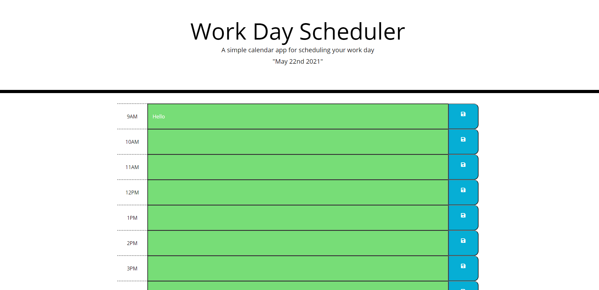
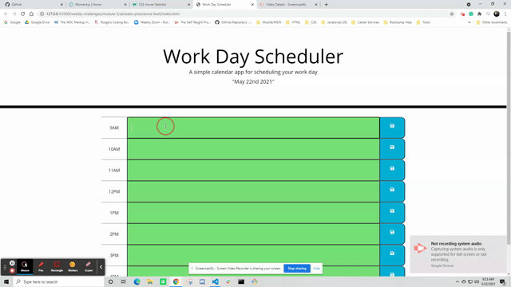

# Work Day Scheduler

## Description

This application was created to allow a user to utilize time blocks and schedule their day. The user will be able to store their tasks in hour blocks and have their tasks persist even when the page is refreshed. 

The day planner shows the user which time blocks are in the past, present, and future by applying classes and background colors. This will allow the user to maximize their use of the day planner and use it accordingly. 

## Screenshot and Gif

## Technology Used

- Moment.js
- JavaScript
- jQuery
- HTML
- CSS